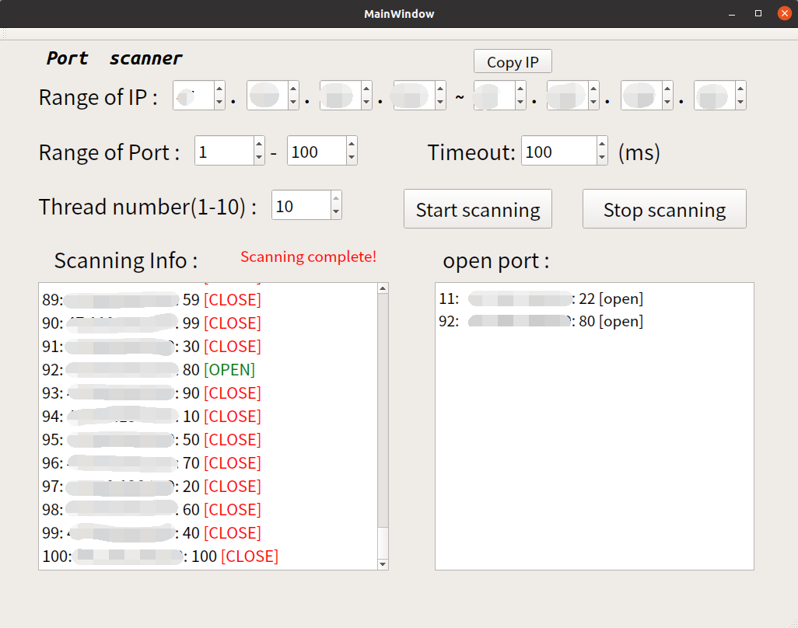

# Port Scanner (QT)

[[中文](README_zh.md)]

----

This is a multi-thread GUI port scanner implemented by QT5.

Known bugs: Some open ports may be incorrectly ignored if the timeout chosen is too short.

It is recommended to choose a small thread number (< 5) if the timeout is less than 200ms.

